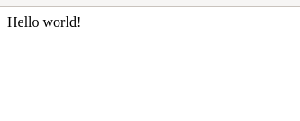

<h1 align="center">
    Day01 - HTML
</h1>

<p align="center">
    
</p>
<br>

<h3 align="center">
    L'objectif de cette journée est de découvrir les bases de l'HTML.
</h3>
<br><br>

### **Qu'est-ce que l'HTML?**

L'HTML (Hypertext Markup Language) est un langage informatique dit de balisage, dû fait de son utilisation de balise afin d'en délimiter les parties. <br><br>

# **Préparatif**

Avant tout lors de l'élaboration d'un programme informatique nous allons utiliser un editeur de texte. Un éditeur de texte nous sert à l'écriture du programme, il l'équivalent de Google Docs ou bien Microsft Word pour les développeur informatique.

Pour cette semaine je vous conseille Sublime Text (sublimetext.com), c'est un éditeur de texte assez sobre et utilisé par de nombreux développeur Web. En alternative, il y a toute fois Visual Studio Code (code.visualstudio.com), qui est plus complet.

> Évidement peu importe l'éditeur de texte que vous choisissez, programmer reste possible!

<br>

# **Le commencement**

Une fois les installations faites nous allons pouvoir commencer, tout d'abord nous allons débuter par création notre fichier.
> Je conseille de le mettre dans un dossier regroupement l'entiéreté des exos de cette semaine.

```
main.html
```

Maintenant faisons un test, ouvrons ce fichier avec l'éditeur de texte précédement choisi, et y écrivons "Hello world!". Ensuite nous allons l'ouvrir avec un navigateur internet (click droit sur le fichier ou double click), et voici le résultat obtenu: <br><br>

<br><br>

# **Objective**
