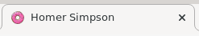

<h1 align="center">
    Day01 - HTML
</h1>

<p align="center">
    
</p>
<br>

<h3 align="center">
    L'objectif de cette journée est de découvrir les bases de l'HTML.
</h3>
<br><br>

### **Qu'est-ce que l'HTML?**

L'HTML (Hypertext Markup Language) est un langage informatique dit de balisage, dû fait de son utilisation de balise afin d'en délimiter les parties. <br><br>

# **Préparatif**

Avant tout lors de l'élaboration d'un programme informatique nous allons utiliser un éditeur de texte. Un éditeur de texte nous sert à l'écriture du programme, ils sont l'équivalent de Google Docs ou bien Microsoft Word pour les développeurs informatiques.

Pour cette semaine je vous conseille Sublime Text (sublimetext.com), c'est un éditeur de texte assez sobre et utilisé par de nombreux développeurs Web. En alternative, il y a toutefois Visual Studio Code (code.visualstudio.com), qui est plus complet.

> Évidemment peu importe l'éditeur de texte que vous choisissez, programmer reste possible!

<br>

# **Le commencement**

Une fois les installations faites nous allons pouvoir commencer, ainsi nous allons débuter par la création de notre fichier.
> Je conseille de le mettre dans un dossier regroupant l'entièreté des exos de cette semaine.

```
main.html
```

Maintenant faisons un test, ouvrons ce fichier avec l'éditeur de texte précédement choisi, et nous y écrirons "Hello world!". Ensuite nous allons l'ouvrir avec un navigateur internet (click droit sur le fichier ou double click), et voici le résultat obtenu: <br><br>

<br><br>

# **Exercice**


> /!\ Attention, vous venez de recevoir un message:
```
??? : Hey! Je suis Marvin et maintenant je suis ton supérieur au sein de la Compute Compagnie! J'espère que tu vas te plaire chez nous!

Enfin bref nous avons un client un peu benêt :/ Et ce sera ta première mission alors je compte sur toi pour faire du bon boulot!

Il souhaite faire un blog pour toute sa famille afin que tout le monde puisse découvrir leurs incroyables vies! Le nom du client est Homer Simpsons.

Afin de vous aider à commencer je vous ai fait un fichier d'exemple regardez-le! (il se trouve dans le repository, 
vous pouvez y accéder via la liste des fichiers sur GitHub)

Voici les demandes du client:
```

### **Exercice 1**

Tout d'abord j'aimerais une page d'accueil, j'aimerais que cette page contienne un titre et une icon cool! Moi j'ai pensé à un donut! :doughnut:

<br><br>

```
Marvin : Bon comme c'est ta première mission je vais te donner quelques indices!
Dans le fichier que je t'ai transmis nous avons différentes sections: head et body.
Mais qu'est-ce que c'est, head permet de préciser des détails sur le document dans cet exercice, ce sera l'icon et le titre de notre site!
Le body quant à lui contient le contenu de la page!

Maintenant dans le fichier donné, tu as deux balises déjà fournies, je te laisse essayer de trouver comment les utiliser! 
```

### **Exercice 2**

Ensuite je veux écrire des trucs, pourquoi pas un titre genre "The Simpson"? Je trouve que ça claque! :star_struck: Ensuite j'aimerais écrire d'autres trucs mais je sais pas quoi raconter, je vous laisse choisir. :no_mouth:

```
Marvin : Retour des petits tips cette fois ce sera rapide! Voici la liste de balise d'écriture:
    - <p><\p>, <a><\a>, <h1><\h1> ... <h6><\h6> => écrire
    - <br> => retour à la ligne
    - <strong></strong>, <em></em>, <b></b>, <i></i>, <u></u> => modifie l'apparance
```

### **Exercice 3**

Oh j'oubliais je veux aussi plein d'images! :framed_picture:

> Utilisez la balise : img

### **Exercice 4**

Je me suis aussi dit que je voulais plusieurs sections, pour ma fille Lisa. Du coup j'ai pensé à une barre de navigation! :nerd_face:

```
Marvin: Wow je sais pas, c'est bizarre on dirait que c'est quelqu'un d'autre qui a écrit à la place du client... Bon bref pour faire une barre de navigation vous devriez utiliser différente balise:
    - <nav></nav> => afin de préciser cette partie dans le code
    - <ol></ol>, <ul></ul>, <li></li> => pour faire une liste des parties
```

### **Exercice 5**

Ainsi les différentes sections se trouveront sur plusieurs pages séparés, je vous laisse libre de leurs contenus.

```
Marvin: Alors d'après la demande du client, commencez par créer un nouveau fichier.html et comme tu as préalablement fait la barre de navigation, il faudra un peu la modifier.
Tu auras besoin d'utiliser la balise <a></a>, avec son attribut 'href', cette balise te permet de faire un lien pour un autre site internet ou bien une autre page de ton site.

Je te laisserais remplir les différentes pages, je te fais confiance! ;)
```

# **Fin**

Maintenant que vous avez fini tous les exos, vous connaissez toutes les bases de l'HTML, vous êtes libre de vous faire plaisir sur le site!!! :smiley:
